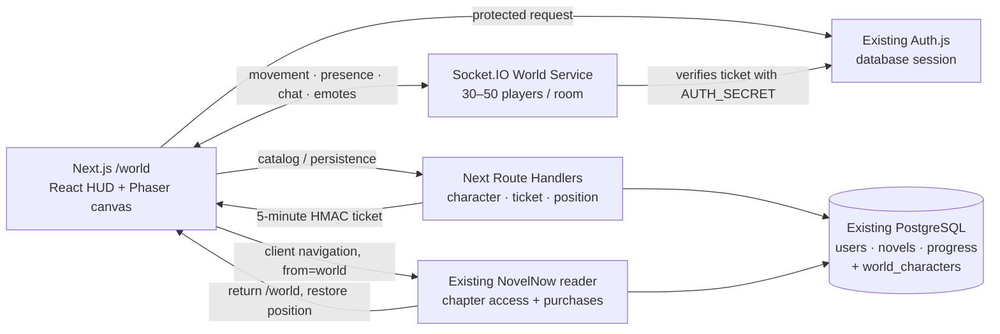

# NovelNow World

NovelNow World is a playable 2.5D manga social-reading vertical slice mounted at `/world`. It extends the existing application; it does not replace auth, novels, chapter access, progress, follows, library state, or the reader.

## What is implemented

- Auth-protected `/world` route using the existing database-backed Auth.js session.
- First-time layered character creator and PostgreSQL persistence.
- Skippable manga-panel introduction and subtle first-session guidance.
- Phaser 3 Central Plaza with smooth movement, click-to-walk, run, camera follow/bounds, data-driven objects, collisions, Y-depth sorting, ambient particles, and reduced-motion behavior.
- Grand Library interaction backed by real NovelNow featured/recommended, continue-reading, and followed data.
- Existing reader navigation with `?from=world`; reader back/Escape and chapter transitions preserve a return to `/world`.
- Position snapshots persisted periodically and before opening the reader; transient movement is never written each frame.
- Socket.IO room instances capped at 50, signed short-lived entry tickets, throttled movement, reconnects, remote interpolation, joins/leaves, chat, speech bubbles, and six emotes.
- Reader Café, Community Hall, World Gate genre previews, seating, and novel/community displays.
- Stable asset manifest plus procedural non-copyrighted V1 art and a complete production-art handoff.

Deferred by design: player homes, community towns, UGC, full community creation, walkable interiors, mobile virtual joystick, friend-aware room selection, block/report UI, and production sprite atlases.

## Run locally

1. Copy `.env.example` to `.env` and configure the existing database/auth values.
2. Apply the new migration with `npm run db:migrate`.
3. Run `npm run dev`. The dev supervisor now starts Next.js, the existing translation worker, and the World Socket.IO service on port 3001.
4. Sign in and open `http://localhost:3000/world`.

To run services separately, use `npm run dev:web` and `npm run world:server`.
With the realtime service running, `npm run world:smoke` verifies ticket authentication, room join, and a chat round trip.

Production multiplayer needs a long-running Node host for `world/server.ts`; Vercel Functions do not host a durable Socket.IO process. Set `NEXT_PUBLIC_WORLD_SOCKET_URL=wss://world.example.com` and `WORLD_ALLOWED_ORIGINS=https://www.example.com`. Without that public URL the world deliberately falls back to solo mode. Redis remains optional in V1; use a Socket.IO Redis adapter before horizontally scaling the realtime companion beyond one process.

## Architecture



Phaser owns rendering, physics, camera, depth, particles, interactions, and network avatars. React owns overlays, character creation, library data, chat panel, connection states, and routing. Shared event contracts live in `world/types.ts`. `world/maps/central-plaza.json` is validated with Zod before any object is rendered.

## Security and failure behavior

- Character, position, intro, and ticket endpoints re-check the existing server session, same-origin policy, and distributed rate limits.
- The realtime service accepts identity/appearance only from an HMAC-signed expiring ticket.
- Server movement validation rejects stale sequences, impossible jumps, out-of-bounds positions, invalid states, and oversized payloads.
- Chat is length-bounded, burst-limited, normalized, link-moderated, and exposes a dedicated moderation function for future block/report rules.
- Socket or catalog failures do not crash Phaser. The user can keep exploring in solo mode and empty catalog shelves degrade visibly.
- Phaser games, sockets, timers, listeners, effects, and collision objects are cleaned up when `/world` unmounts.

## Database change

Migration `drizzle/20260912062957_cynical_terrax.sql` adds one `world_characters` row per existing user. It stores appearance, display name, meaningful world position, intro completion, and last-seen timestamps. Unique/indexed fields cover user ownership, case-insensitive names, and instance/last-seen lookup. No user, novel, bookshelf, purchase, follow, or progress source of truth is duplicated.

## Manual acceptance checklist

- [ ] Sign in through the existing Google login and open `/world`; a signed-out visit returns to login.
- [ ] Create a named character, choose every appearance category, select no more than two accessories, and save.
- [ ] Skip or complete the three intro panels; refresh and confirm they do not reappear.
- [ ] Move with WASD and arrows, run with Shift, click a walk target, and confirm the camera never reveals map void.
- [ ] Walk around the fountain, trees, buildings, benches, cart, and portal; confirm collision and front/behind depth.
- [ ] Open two authenticated browsers, enter the world, and confirm join/leave, smooth remote movement, room count, reconnect, and no snapping.
- [ ] Press Enter, send chat, confirm panel history and speech bubbles; test length and burst limits.
- [ ] Send wave, heart, laugh, surprise, book, and sparkle emotes in both browsers.
- [ ] Walk to Grand Library, press E, and confirm real trending/recommended, continue-reading, and followed shelves.
- [ ] Search the loaded real catalog, choose a novel, and open the existing reader.
- [ ] Read/scroll a chapter, move to an adjacent chapter, use the top-left back button, and confirm `/world` returns near the saved position without a document reload.
- [ ] Disconnect the realtime service and confirm the connection badge changes to solo mode while movement and library interactions remain usable.
- [ ] Test at 1440×900, 1024×768, and a narrow mobile viewport; confirm HUD/panels stay in bounds.
- [ ] Enable reduced motion and confirm ambient/tween intensity is reduced.

## Verification commands

```text
npm run lint
npm run typecheck
npm test
npm run db:check
npm run build
```
